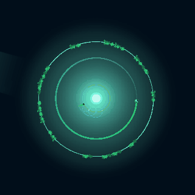
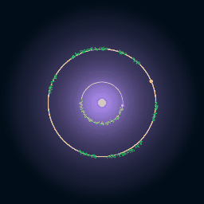
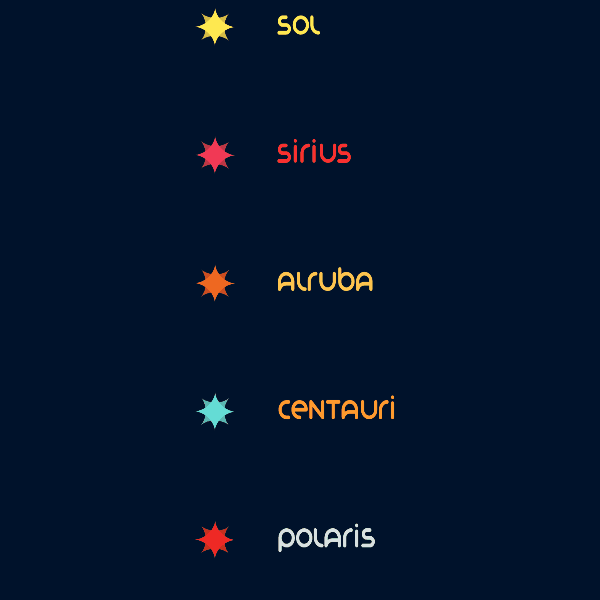

# Through Space

Through Space is a mobile game also released on PC. You play a spaceship travelling through star systems. Avoiding colliding with asteroids and drifting away in space. You must orbit the planets in your way and use them to slingshot towards the next star.

It features save states, dynamic audio operations and seamless gameplay. There are absolutely no loading screens between each level and the game runs on the most primitive android devices. 

Through Space was created to be a calm and easy experience. Even though the GUI allows you to control time, camera position and zoom, the main inputs are only two: Orbit and Release.
You can play it from start to end with no interruptions. The game has a proper soundtrack with classical and chill songs and all planets has its own ambience sound.

